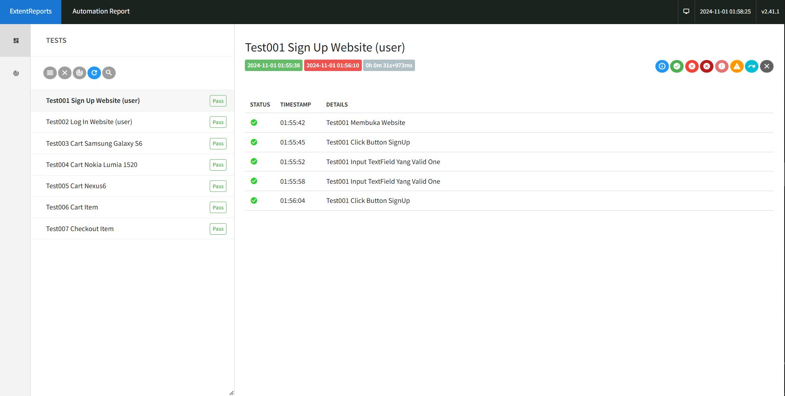
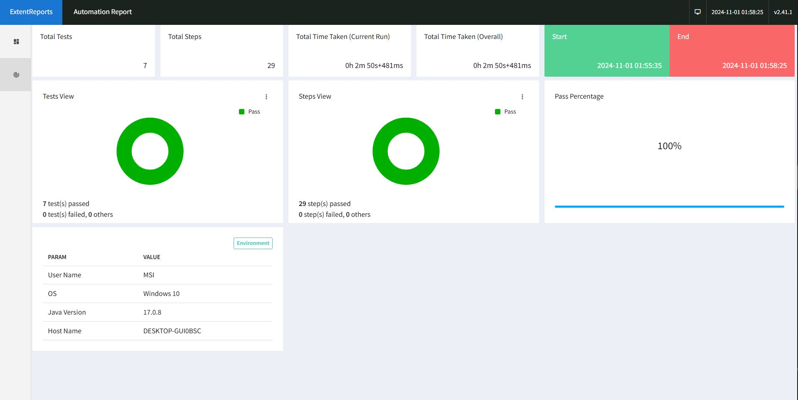
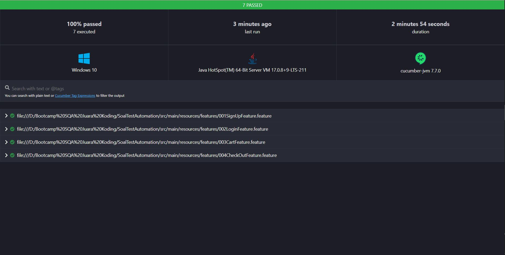

<h1 align="center" id="title">Soal Test Automation PT.Akhdani-Raka-Solusi</h1>

<p align="center"></p>

<p id="description">WEB UI Automation Testing for Siloam Website</p>

<h2>Selenium Report:</h2>




<h2>Cucumber Report:</h2>



<h2>🧐 Features</h2>

Here're some of the project's best features:

<h2>🛠️ Installation Steps:</h2>

<p>1. Download the jar file from link</p>

```
https://drive.google.com/drive/folders/1qp_K92k-6d7-H_dtjRpuQa2yNwsH4nTE?usp=sharing
```

<p>2. Open CMD and jar file directory</p>

<p>3. run</p>

```
Java -jar kurniawansqa-jar-with-dependencies.jar
```

  
<h2>💻 Built with</h2>

Technologies used in the project:

*   Cucumber and Gherkin
*   Java
*   Maven
*   Selenium Webdriver
*   TestNG
